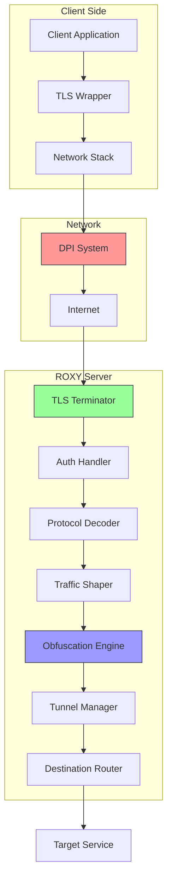
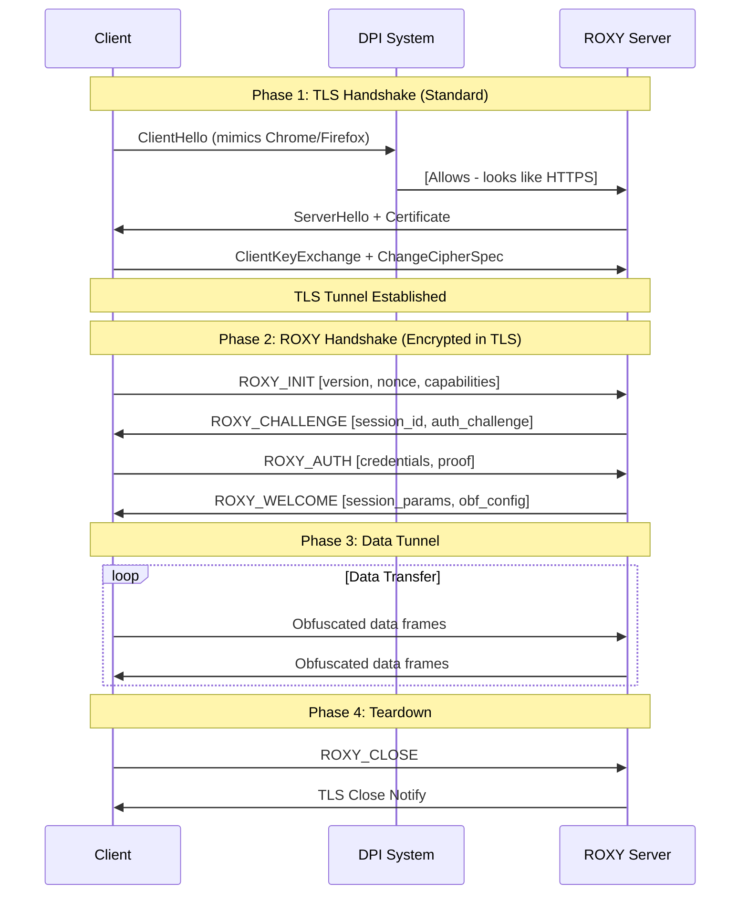
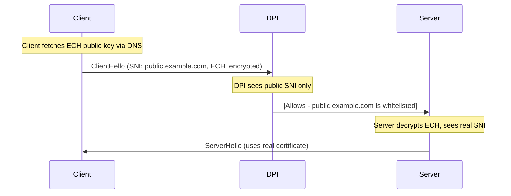
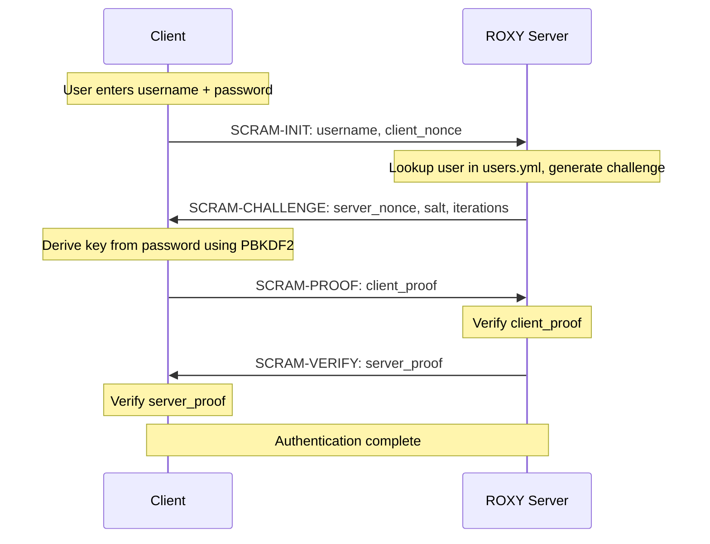
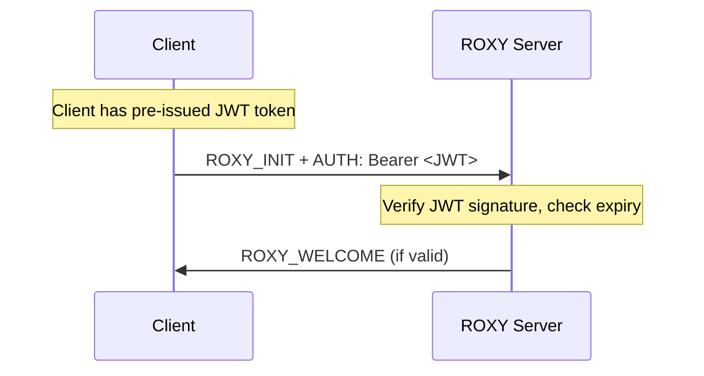
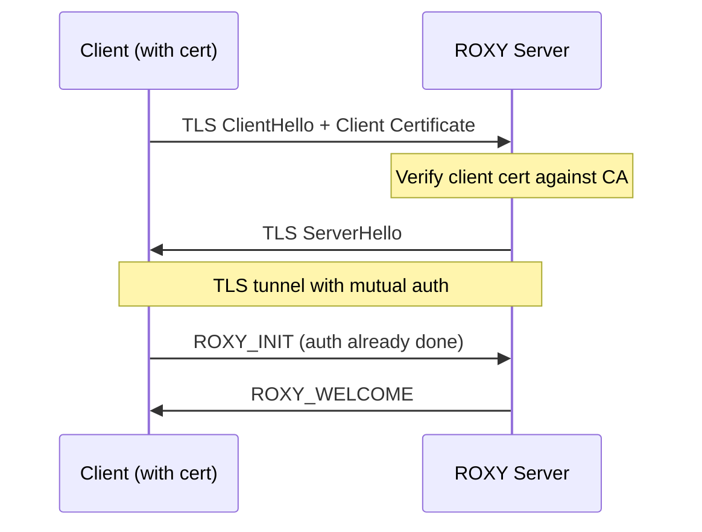
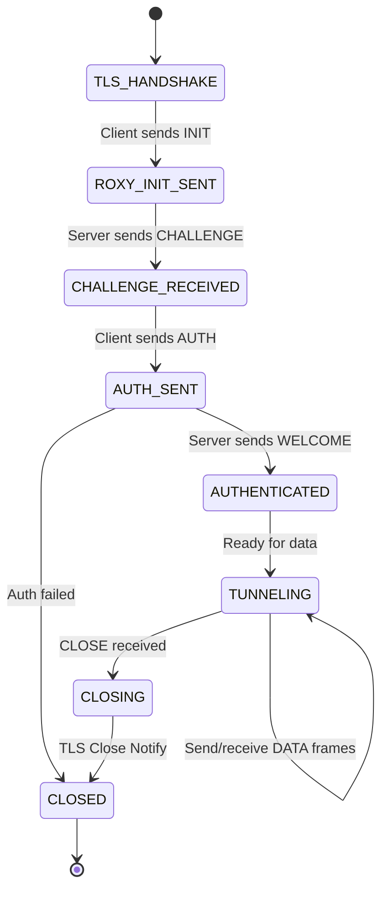
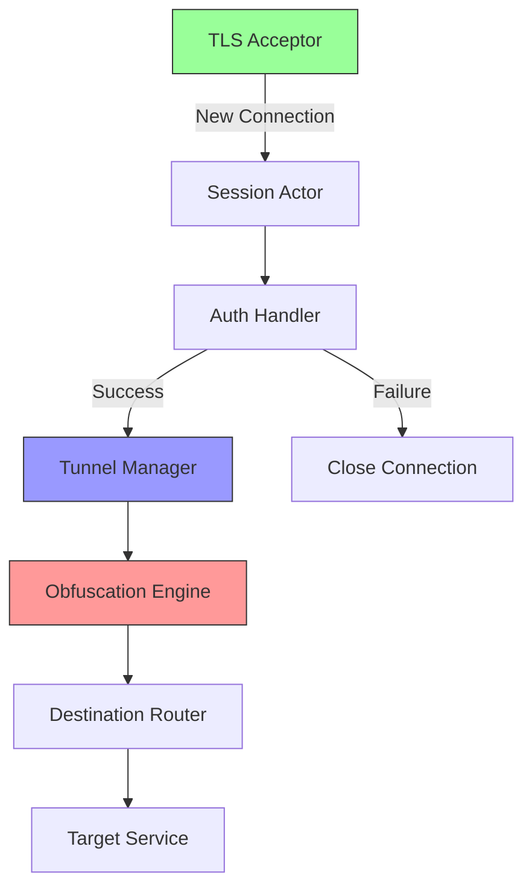
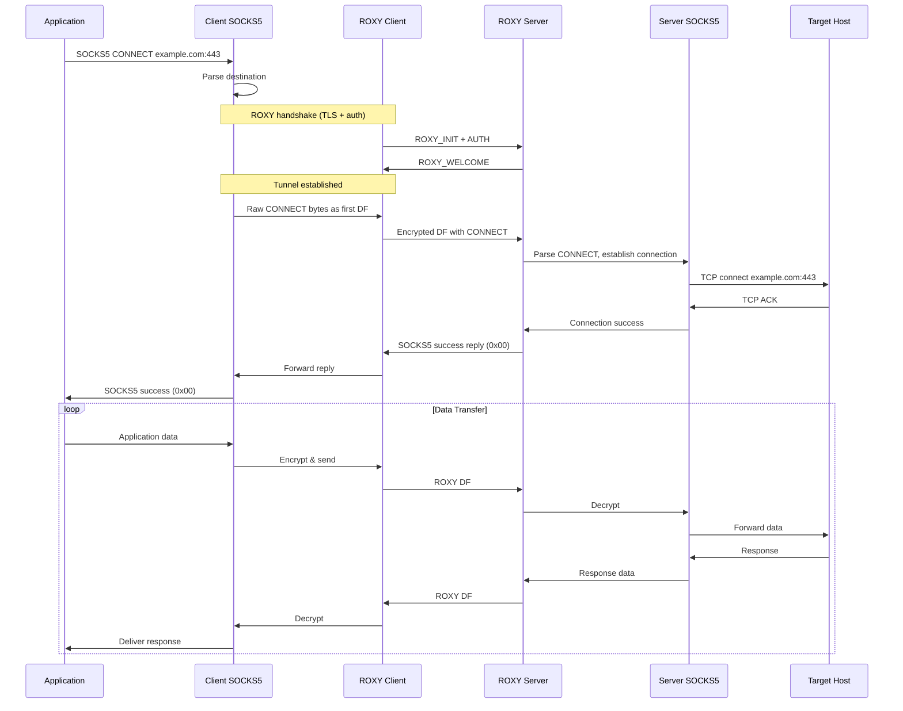

---
**READ ONLY**
---

# DPI-Resistant Protocol Design: Project ROXY

## Executive Summary

**Project ROXY** is a novel network protocol designed to resist Deep Packet Inspection (DPI) while maintaining security, performance, and usability. The protocol employs multi-layered obfuscation, TLS mimicry, and adaptive traffic shaping to evade detection and blocking.

**Core Design Principles**:
1. **Indistinguishability**: Traffic appears as standard HTTPS to both passive and active DPI systems
2. **Defense in Depth**: Multiple obfuscation layers (TLS, application-layer, traffic shaping)
3. **Forward Security**: Compromise of one session doesn't affect others
4. **Deployability**: Server-side only, works with standard clients through transparent proxying
5. **Maintainability**: Modular design allows swapping obfuscation techniques as DPI evolves

---

## Table of Contents

1. [Architecture Overview](#architecture-overview)
2. [Core Protocol Mechanics](#core-protocol-mechanics)
3. [TLS Integration Strategy](#tls-integration-strategy)
4. [User Authentication System](#user-authentication-system)
5. [Traffic Obfuscation Layer](#traffic-obfuscation-layer)
6. [Protocol Specification](#protocol-specification)
7. [Implementation Considerations](#implementation-considerations)

---

## Architecture Overview

### System Components



### Protocol Stack

```
┌─────────────────────────────────────┐
│   Application Data (HTTP, etc.)    │ ← User traffic
├─────────────────────────────────────┤
│      ROXY Application Protocol      │ ← Authentication, framing, obfuscation
├─────────────────────────────────────┤
│         TLS 1.3 Encryption          │ ← Standard TLS with mimicry
├─────────────────────────────────────┤
│         TCP (Port 443/8443)         │ ← Transport
├─────────────────────────────────────┤
│           IP (IPv4/IPv6)            │ ← Network
└─────────────────────────────────────┘
```

### Design Goals vs DPI Detection Vectors

| DPI Detection Method | ROXY Counter-Measure |
|---------------------|---------------------|
| **TLS Fingerprinting** | Mimic popular TLS clients (Chrome, Firefox) |
| **SNI Analysis** | Use Encrypted Client Hello (ECH) or whitelisted domains |
| **Certificate Inspection** | Use legitimate certificates from trusted CAs |
| **Traffic Pattern Analysis** | Shape traffic to match HTTPS browsing patterns |
| **Payload Entropy Analysis** | Nested encryption appears as standard TLS application data |
| **Connection Duration** | Mimic web session lifetimes with automatic reconnection |
| **Packet Size Distribution** | Match typical HTTPS size distributions |
| **Timing Analysis** | Add random jitter, mimic interactive browsing |

---

## Core Protocol Mechanics

### Connection Lifecycle



### Handshake Protocol

#### Phase 1: TLS Bootstrap (Standard TLS 1.3)

**Objective**: Establish encrypted channel that appears as legitimate HTTPS.

**Implementation**:
- Use standard TLS 1.3 libraries (OpenSSL, BoringSSL)
- Configure TLS parameters to mimic popular browsers
- Support ALPN (Application-Layer Protocol Negotiation) with `h2` (HTTP/2)

**TLS Configuration**:
```yaml
tls:
  min_version: TLS1.3
  cipher_suites:
    - TLS_AES_128_GCM_SHA256
    - TLS_AES_256_GCM_SHA384
    - TLS_CHACHA20_POLY1305_SHA256
  supported_groups:
    - x25519
    - secp256r1
    - secp384r1
  signature_algorithms:
    - rsa_pss_rsae_sha256
    - ecdsa_secp256r1_sha256
  alpn_protocols:
    - h2        # HTTP/2
    - http/1.1  # HTTP/1.1 fallback
```

**Certificate Strategy**:
- Use legitimate certificates from trusted CAs (Let's Encrypt, DigiCert)
- Wildcard certificates for domain flexibility
- Alternate: Self-signed with custom CA (requires client trust)

#### Phase 2: ROXY Handshake (Encrypted within TLS)

**Objective**: Authenticate user and establish obfuscation parameters.

**Message Format** (all messages encrypted by TLS):

##### ROXY_INIT (Client → Server)
```
┌────────────────────────────────────────┐
│ Message Type: 0x01 (1 byte)            │
├────────────────────────────────────────┤
│ Protocol Version: 0x01 (1 byte)        │
├────────────────────────────────────────┤
│ Flags: 0x00 (2 bytes, reserved)        │
├────────────────────────────────────────┤
│ Client Nonce: (32 bytes, random)       │
├────────────────────────────────────────┤
│ Capabilities Bitmap: (4 bytes)         │
│   - Bit 0: Supports obfs4              │
│   - Bit 1: Supports traffic shaping    │
│   - Bit 2: Supports chunked mode       │
│   - Bits 3-31: Reserved                │
├────────────────────────────────────────┤
│ Padding: (0-255 bytes, random length)  │
└────────────────────────────────────────┘
```

**Key Design Choices**:
- **Random padding**: Prevents fingerprinting by varying message size
- **Nonce**: Prevents replay attacks
- **Version field**: Allows protocol evolution
- **Capabilities**: Client advertises supported obfuscation methods

##### ROXY_CHALLENGE (Server → Client)
```
┌────────────────────────────────────────┐
│ Message Type: 0x02 (1 byte)            │
├────────────────────────────────────────┤
│ Session ID: (16 bytes, UUID)           │
├────────────────────────────────────────┤
│ Server Nonce: (32 bytes, random)       │
├────────────────────────────────────────┤
│ Auth Method: 0x01 (1 byte)             │
│   - 0x01: Password-based (SCRAM)       │
│   - 0x02: Token-based (JWT)            │
│   - 0x03: Certificate-based (mTLS)     │
├────────────────────────────────────────┤
│ Challenge Data: (variable)             │
│   For password: SCRAM challenge        │
│   For token: Token spec version        │
├────────────────────────────────────────┤
│ Padding: (0-255 bytes, random)         │
└────────────────────────────────────────┘
```

##### ROXY_AUTH (Client → Server)
```
┌────────────────────────────────────────┐
│ Message Type: 0x03 (1 byte)            │
├────────────────────────────────────────┤
│ Session ID: (16 bytes, echo)           │
├────────────────────────────────────────┤
│ Auth Proof: (variable length)          │
│   For password: SCRAM proof            │
│   For token: Signed JWT                │
├────────────────────────────────────────┤
│ Requested Routes: (variable)           │
│   - List of allowed destinations       │
│   - Format: proto:host:port pairs      │
├────────────────────────────────────────┤
│ Padding: (0-255 bytes, random)         │
└────────────────────────────────────────┘
```

##### ROXY_WELCOME (Server → Client)
```
┌────────────────────────────────────────┐
│ Message Type: 0x04 (1 byte)            │
├────────────────────────────────────────┤
│ Status: 0x00 (1 byte, 0=success)       │
├────────────────────────────────────────┤
│ Session Lifetime: (4 bytes, seconds)   │
├────────────────────────────────────────┤
│ Obfuscation Config: (variable)         │
│   - Selected obfuscation method        │
│   - Traffic shaping parameters         │
│   - Padding strategy                   │
├────────────────────────────────────────┤
│ Granted Routes: (variable)             │
│   - List of allowed destinations       │
│   - Per-user access control            │
├────────────────────────────────────────┤
│ Padding: (0-255 bytes, random)         │
└────────────────────────────────────────┘
```

**Handshake Security Properties**:
- ✅ **Replay Protection**: Nonces prevent replay attacks
- ✅ **Forward Secrecy**: Session keys derived from ephemeral DH (via TLS)
- ✅ **Mutual Authentication**: Server proves identity via TLS cert, client via SCRAM/token
- ✅ **Confidentiality**: All handshake data encrypted by TLS tunnel
- ✅ **Polymorphism**: Random padding makes each handshake unique

---

### Data Framing & Encapsulation

#### Frame Structure

All data after handshake is encapsulated in ROXY frames (encrypted within TLS):

```
┌────────────────────────────────────────┐
│ Frame Header                           │
│  ┌──────────────────────────────────┐  │
│  │ Frame Type: (1 byte)             │  │
│  │   - 0x10: Data frame             │  │
│  │   - 0x11: Ping/keepalive         │  │
│  │   - 0x12: Control message        │  │
│  │   - 0xFF: Close                  │  │
│  ├──────────────────────────────────┤  │
│  │ Stream ID: (4 bytes)             │  │
│  │   - Multiplexing multiple flows  │  │
│  ├──────────────────────────────────┤  │
│  │ Payload Length: (2 bytes)        │  │
│  │   - Actual data length           │  │
│  ├──────────────────────────────────┤  │
│  │ Flags: (1 byte)                  │  │
│  │   - Bit 0: FIN (last frame)      │  │
│  │   - Bit 1: Compressed            │  │
│  │   - Bits 2-7: Reserved           │  │
│  └──────────────────────────────────┘  │
├────────────────────────────────────────┤
│ Payload: (0-16384 bytes)               │
│   - Actual tunneled data               │
├────────────────────────────────────────┤
│ Obfuscation Padding: (0-1024 bytes)    │
│   - Random bytes to obscure size       │
└────────────────────────────────────────┘
```

**Frame Design Rationale**:
- **Stream multiplexing**: Multiple concurrent tunnels over one connection (like HTTP/2)
- **Variable padding**: Defeats packet size fingerprinting
- **Small frames**: 16KB max prevents large TLS records that are suspicious
- **Frame types**: Allows protocol extensions without breaking compatibility

#### Data Encoding & Encryption

**Layered Encryption**:
```
Original Data
    ↓
[Application Layer Encryption] (optional, e.g., Signal Protocol)
    ↓
ROXY Framing + Obfuscation Padding
    ↓
[TLS 1.3 Encryption] (AES-GCM or ChaCha20-Poly1305)
    ↓
TCP Segments
```

**Why Double Encryption?**
1. **TLS alone**: Can be terminated by MITM (gov/enterprise proxies)
2. **Application encryption**: Even if TLS is broken, payload remains secret
3. **Defense in depth**: Assume TLS is monitored, add second layer

**Payload Obfuscation**:
```python
def obfuscate_payload(data, config):
    # 1. Optional compression (with caution - CRIME attack mitigation)
    if config.compress and len(data) > 1024:
        data = zstd.compress(data)
    
    # 2. Application-layer AEAD encryption
    nonce = os.urandom(12)
    ciphertext = chacha20_poly1305_encrypt(
        key=session_key,
        nonce=nonce,
        plaintext=data,
        aad=frame_header
    )
    
    # 3. Add random padding to obscure size
    padding_len = random.randint(0, config.max_padding)
    padding = os.urandom(padding_len)
    
    # 4. Construct final frame
    frame = nonce + ciphertext + padding
    
    return frame
```

---

### Traffic Shaping & Pattern Obfuscation

#### Objective
Make ROXY traffic statistically indistinguishable from legitimate HTTPS browsing.

#### Techniques

##### 1. Packet Size Distribution Matching

**Problem**: Custom protocols have characteristic packet sizes.

**Solution**: Sample from real HTTPS traffic distribution.

```python
# Pre-collected distribution from Chrome browsing HTTPS sites
HTTPS_SIZE_DISTRIBUTION = {
    64: 0.05,    # Small ACKs, control packets
    128: 0.08,   # Headers
    256: 0.12,   # Small responses
    512: 0.15,   # Medium responses
    1024: 0.20,  # Common chunk size
    1460: 0.25,  # MTU-sized packets (1500 - headers)
    16384: 0.15  # Large chunks
}

def shape_packet_size(data, target_distribution=HTTPS_SIZE_DISTRIBUTION):
    """Split data into chunks matching HTTPS size distribution"""
    chunks = []
    remaining = data
    
    while remaining:
        # Sample size from distribution
        size = weighted_random_choice(target_distribution)
        
        if len(remaining) < size:
            # Last chunk - pad to size or use as-is
            chunk = remaining + os.urandom(size - len(remaining))
        else:
            chunk = remaining[:size]
            remaining = remaining[size:]
        
        chunks.append(chunk)
    
    return chunks
```

##### 2. Timing Pattern Mimicry

**Problem**: Interactive protocols have distinctive timing (keystrokes, request-response).

**Solution**: Add jitter to mimic web browsing patterns.

```python
# Web browsing characteristics
class BrowsingTimingProfile:
    # Time between user actions (clicking links, scrolling)
    inter_request_delays = {
        "min": 0.5,      # Fast user
        "median": 2.0,   # Typical
        "max": 30.0      # Reading content
    }
    
    # Server response delays
    server_response_delays = {
        "min": 0.01,     # Cached content
        "median": 0.15,  # Typical server processing
        "max": 2.0       # Slow backend
    }

def add_browsing_jitter(send_callback, data):
    """Send data with realistic browsing delays"""
    chunks = split_into_http_like_requests(data)
    
    for chunk in chunks:
        # Client "thinks" before sending request
        client_delay = random.lognormal(
            mu=math.log(BrowsingTimingProfile.inter_request_delays["median"]),
            sigma=0.8
        )
        time.sleep(client_delay)
        
        send_callback(chunk)
        
        # Server processing delay
        # (Server adds this delay before responding)
```

##### 3. Connection Lifetime Mimicry

**Problem**: Long-lived connections are suspicious (VPNs, tunnels).

**Solution**: Reconnect periodically to mimic browsing sessions.

```python
class SessionManager:
    # Typical web session characteristics
    SESSION_DURATION_SECONDS = {
        "min": 30,
        "median": 180,   # 3 minutes (tab open, some browsing)
        "max": 1800      # 30 minutes (long reading session)
    }
    
    def manage_session_lifetime(self):
        """Automatically reconnect to mimic session lifecycle"""
        lifetime = random.lognormal(
            mu=math.log(self.SESSION_DURATION_SECONDS["median"]),
            sigma=0.6
        )
        
        # After lifetime expires, gracefully close and reconnect
        schedule_reconnect(after=lifetime)
```

##### 4. Dummy Traffic Injection

**Problem**: Idle connections stand out; legitimate browsing has background activity.

**Solution**: Inject dummy requests during idle periods.

```python
def inject_dummy_traffic(connection, idle_threshold=5.0):
    """Inject fake HTTPS-like requests during idle periods"""
    last_activity = time.time()
    
    while connection.active:
        idle_time = time.time() - last_activity
        
        if idle_time > idle_threshold:
            # Inject dummy request (e.g., favicon, CSS, analytics)
            dummy_request = generate_fake_http_request()
            connection.send(dummy_request)
            
            # Server responds with dummy data
            dummy_response = connection.receive()
            
            last_activity = time.time()
        
        time.sleep(1.0)
```

##### 5. Bidirectional Flow Ratio Matching

**Problem**: Most tunnels have symmetric upload/download; browsing is skewed (more download).

**Solution**: Match typical browsing ratios.

```python
# Typical browsing: 1:10 to 1:20 upload:download ratio
# User sends small requests, receives large responses

def balance_traffic_ratio(connection, target_download_ratio=15):
    """Ensure download >> upload to mimic browsing"""
    upload_bytes = connection.bytes_sent
    download_bytes = connection.bytes_received
    
    current_ratio = download_bytes / max(upload_bytes, 1)
    
    if current_ratio < target_download_ratio:
        # Inject dummy download traffic
        deficit = upload_bytes * target_download_ratio - download_bytes
        inject_dummy_download(connection, deficit)
```

---

## TLS Integration Strategy

### Mandatory TLS Approach

**Design Decision**: ROXY **requires** TLS 1.3 as the base transport layer.

**Rationale**:
1. **Ubiquity**: HTTPS is the most common protocol; blocking it breaks modern web
2. **Tooling**: Mature TLS libraries (OpenSSL, BoringSSL, rustls) are battle-tested
3. **Security**: TLS 1.3 provides strong cryptographic guarantees
4. **Plausible Deniability**: ROXY traffic is indistinguishable from HTTPS at packet level

### TLS Configuration for DPI Resistance

#### 1. Client TLS Fingerprint Mimicry

**Problem**: TLS ClientHello parameters create unique fingerprints.

**Solution**: Mimic popular browsers exactly.

**Tool**: Use [JA3](https://github.com/salesforce/ja3) fingerprinting to match targets.

```python
# Chrome 120 (example) TLS fingerprint
chrome_120_ja3 = {
    "tls_version": 0x0303,  # TLS 1.2 in ClientHello (upgraded to 1.3)
    "cipher_suites": [
        0x1301,  # TLS_AES_128_GCM_SHA256
        0x1302,  # TLS_AES_256_GCM_SHA384
        0x1303,  # TLS_CHACHA20_POLY1305_SHA256
        0xc02b,  # TLS_ECDHE_ECDSA_WITH_AES_128_GCM_SHA256
        # ... full Chrome suite list
    ],
    "extensions": [
        0x0000,  # server_name (SNI)
        0x0017,  # extended_master_secret
        0x0023,  # session_ticket
        0x000a,  # supported_groups
        0x000b,  # ec_point_formats
        # ... full extension list in exact order
    ],
    "supported_groups": [
        0x001d,  # x25519
        0x0017,  # secp256r1
        0x0018,  # secp384r1
    ],
    "signature_algorithms": [
        0x0403,  # ecdsa_secp256r1_sha256
        0x0804,  # rsa_pss_rsae_sha256
        # ... full list
    ]
}

# Use a library like "tls-client" or "curl-impersonate" to replicate
from tls_client import Session

client = Session(client_identifier="chrome_120")
# This mimics Chrome 120's TLS fingerprint exactly
```

#### 2. Encrypted Client Hello (ECH)

**Problem**: SNI (Server Name Indication) is sent in plaintext, revealing destination.

**Solution**: Use TLS 1.3 Encrypted Client Hello (ECH, formerly ESNI).

**Mechanism**:


**Implementation**:
```yaml
tls_ech:
  enabled: true
  public_domain: "cloudflare.com"  # Whitelisted domain
  real_domain: "roxy.example.com"  # Actual ROXY server
  ech_key_source: "dns"  # Fetch ECH key via DNS TXT record
```

**Status**: ECH is supported in TLS 1.3 implementations (BoringSSL, NSS, OpenSSL 3.2+).

#### 3. ALPN (Application-Layer Protocol Negotiation)

**Strategy**: Advertise HTTP/2 to appear as web traffic.

```python
tls_context.set_alpn_protocols(["h2", "http/1.1"])
```

**Benefit**: DPI expects HTTP/2 traffic over TLS, which is common for HTTPS.

#### 4. Certificate Strategy

**Option A: Legitimate CA-Signed Certificates**
- Obtain wildcard certificate from Let's Encrypt or commercial CA
- **Pros**: No client configuration, appears legitimate
- **Cons**: Domain ownership required, certificate transparency logs

**Option B: Self-Signed CA**
- Generate custom CA, sign server certificates
- Clients trust custom CA root
- **Pros**: Full control, no external dependencies
- **Cons**: Requires client configuration, may trigger warnings

**Recommended**: Option A for production (use legitimate certs).

#### 5. TLS Session Resumption

**Feature**: TLS session tickets allow fast reconnection.

**Security Consideration**: Session ticket keys must rotate frequently to maintain forward secrecy.

```python
tls_config = {
    "session_tickets": True,
    "ticket_key_rotation": 3600,  # Rotate every hour
}
```

---

### TLS Termination Point

**Server Architecture**:
```
┌─────────────────────────────────────────┐
│          ROXY Server                    │
│                                         │
│  ┌────────────────────────────────────┐ │
│  │   TLS Terminator (BoringSSL)       │ │ ← Handles TLS handshake
│  └─────────────┬──────────────────────┘ │
│                ↓                         │
│  ┌────────────────────────────────────┐ │
│  │   ROXY Protocol Handler            │ │ ← Decodes ROXY frames
│  └─────────────┬──────────────────────┘ │
│                ↓                         │
│  ┌────────────────────────────────────┐ │
│  │   Tunnel Manager                   │ │ ← Routes to destinations
│  └────────────────────────────────────┘ │
└─────────────────────────────────────────┘
```

**Implementation Note**: TLS is terminated at the server edge, then ROXY protocol is decoded from the decrypted stream.

---

## User Authentication System

### Requirements

1. **CLI Compatible**: Command-line tools can authenticate easily
2. **users.yml Support**: User credentials stored in YAML file (server-side)
3. **Secure**: No plaintext password transmission
4. **Replay Protection**: Prevent replay attacks
5. **Lightweight**: Minimal overhead for handshake

### Authentication Methods

#### Method 1: SCRAM (Salted Challenge Response Authentication Mechanism)

**Recommended** for password-based authentication.

**Advantages**:
- No password transmitted over network (even encrypted)
- Server stores salted hash, not plaintext password
- Mutual authentication (client verifies server too)
- Resistant to replay attacks

**Flow**:


**Client Pseudocode**:
```python
def scram_authenticate(username, password, server):
    # Client generates nonce
    client_nonce = os.urandom(16).hex()
    
    # Send username and nonce
    server.send(f"SCRAM-INIT:{username},{client_nonce}")
    
    # Receive challenge
    challenge = server.receive()
    server_nonce, salt, iterations = parse_challenge(challenge)
    
    # Derive key from password
    salted_password = pbkdf2_hmac(
        hash_name='sha256',
        password=password.encode(),
        salt=bytes.fromhex(salt),
        iterations=iterations
    )
    
    # Compute client proof
    auth_message = f"{username},{client_nonce},{server_nonce}"
    client_key = hmac_sha256(salted_password, "Client Key")
    stored_key = sha256(client_key)
    client_signature = hmac_sha256(stored_key, auth_message)
    client_proof = xor_bytes(client_key, client_signature)
    
    # Send proof
    server.send(f"SCRAM-PROOF:{client_proof.hex()}")
    
    # Verify server
    server_verify = server.receive()
    expected_server_proof = compute_server_proof(...)
    assert server_verify == expected_server_proof
    
    return True  # Authenticated
```

**users.yml Format**:
```yaml
users:
  alice:
    scram:
      salt: "a1b2c3d4e5f6..."
      iterations: 100000
      stored_key: "sha256_of_client_key..."
      server_key: "hmac_sha256_of_salted_password..."
    permissions:
      allowed_routes:
        - "tcp:example.com:80"
        - "tcp:example.com:443"
      bandwidth_limit: "10MB/s"
  
  bob:
    scram:
      salt: "f6e5d4c3b2a1..."
      iterations: 100000
      stored_key: "..."
      server_key: "..."
    permissions:
      allowed_routes:
        - "*"  # Allow all
      bandwidth_limit: "100MB/s"
```

**Server Implementation**:
```python
import yaml

def load_users(path="users.yml"):
    with open(path) as f:
        return yaml.safe_load(f)

def authenticate_scram(username, client_proof, server):
    users = load_users()
    
    if username not in users:
        return False
    
    user = users[username]
    stored_key = bytes.fromhex(user["scram"]["stored_key"])
    server_key = bytes.fromhex(user["scram"]["server_key"])
    
    # Verify client proof
    auth_message = reconstruct_auth_message(...)
    client_signature = hmac_sha256(stored_key, auth_message)
    expected_client_key = xor_bytes(client_proof, client_signature)
    
    if sha256(expected_client_key) != stored_key:
        return False  # Invalid proof
    
    # Generate server proof
    server_signature = hmac_sha256(server_key, auth_message)
    server.send(f"SCRAM-VERIFY:{server_signature.hex()}")
    
    return True  # Authenticated
```

#### Method 2: Token-Based (JWT)

**Alternative** for pre-shared tokens or API keys.

**Use Case**: Automated clients, service accounts.

**Flow**:


**JWT Structure**:
```json
{
  "header": {
    "alg": "HS256",
    "typ": "JWT"
  },
  "payload": {
    "sub": "alice",
    "iat": 1674000000,
    "exp": 1674086400,
    "permissions": {
      "routes": ["tcp:example.com:443"],
      "bandwidth": "10MB/s"
    }
  },
  "signature": "HMAC-SHA256(header.payload, secret)"
}
```

**users.yml for Token Method**:
```yaml
users:
  alice:
    auth_method: "jwt"
    jwt_secret: "base64_encoded_secret_key"
    permissions:
      allowed_routes: ["*"]
      bandwidth_limit: "50MB/s"
```

**Advantages**:
- Stateless (server doesn't need to track sessions)
- Tokens can be revoked by expiry or blacklist
- Suitable for programmatic access

**Disadvantages**:
- Token leakage compromises account until expiry
- Requires secure token distribution

#### Method 3: Mutual TLS (mTLS)

**Advanced** method using client certificates.

**Use Case**: High-security environments, enterprise deployments.

**Flow**:


**Configuration**:
```yaml
tls:
  client_auth: "require"
  client_ca: "/path/to/client-ca.pem"

users:
  # Users identified by certificate CN (Common Name)
  alice:
    auth_method: "mtls"
    cert_cn: "alice@example.com"
    permissions:
      allowed_routes: ["*"]
```

**Trade-offs**:
- **Pros**: Strongest authentication, no password needed
- **Cons**: Complex certificate management, requires PKI infrastructure

---

### User Authorization (Post-Authentication)

After authentication, enforce per-user access control:

```python
class TunnelManager:
    def create_tunnel(self, user, destination):
        # Check if user is allowed to access destination
        if not self.is_route_allowed(user, destination):
            raise PermissionDenied(f"{user} cannot access {destination}")
        
        # Check bandwidth limits
        if user.current_bandwidth > user.bandwidth_limit:
            raise RateLimitExceeded(f"{user} exceeded bandwidth")
        
        # Create tunnel
        tunnel = Tunnel(destination)
        self.active_tunnels[user].append(tunnel)
        return tunnel
    
    def is_route_allowed(self, user, destination):
        allowed = user.permissions["allowed_routes"]
        
        if "*" in allowed:
            return True  # Wildcard access
        
        # Check exact match or pattern
        for pattern in allowed:
            if fnmatch(destination, pattern):
                return True
        
        return False
```

---

## Traffic Obfuscation Layer

### Pluggable Obfuscation Architecture

**Design Goal**: Support multiple obfuscation techniques, switchable based on threat landscape.

```python
class ObfuscationEngine:
    """Base class for obfuscation plugins"""
    
    def obfuscate(self, plaintext: bytes) -> bytes:
        raise NotImplementedError
    
    def deobfuscate(self, ciphertext: bytes) -> bytes:
        raise NotImplementedError

class OBFS4(ObfuscationEngine):
    """obfs4 implementation (Tor-style obfuscation)"""
    # Implements randomized padding, polymorphic framing
    pass

class FTE(ObfuscationEngine):
    """Format-Transforming Encryption"""
    # Makes ciphertext match regex (e.g., HTTP-like)
    pass

class TrafficShaper(ObfuscationEngine):
    """Statistical traffic shaping"""
    # Mimics HTTPS packet size/timing distribution
    pass

# Server selects obfuscation based on config or client capability
obfuscator = OBFS4() if client.supports_obfs4 else TrafficShaper()
```

### Obfuscation Techniques Implemented

#### 1. OBFS4 (Obfuscation 4)

**Source**: Tor Project pluggable transport.

**Mechanism**:
- Randomized padding on every packet
- Polymorphic framing (variable-length headers)
- IAT (Inter-Arrival Time) obfuscation

**Effectiveness**: Defeats signature-based DPI, frustrates traffic analysis.

**Reference**: https://gitlab.com/yawning/obfs4

#### 2. Format-Transforming Encryption (FTE)

**Mechanism**:
- Define regex for allowed protocol (e.g., HTTP)
- Encrypt data such that ciphertext matches regex

**Example**:
```python
# Regex for HTTP GET request
http_regex = r"GET /[a-z0-9]+ HTTP/1\.1\r\nHost: [a-z]+\.com\r\n\r\n"

# Encrypt data to match this format
ciphertext = fte_encrypt(plaintext, regex=http_regex)
# ciphertext looks like: "GET /ae45xk32 HTTP/1.1\r\nHost: example.com\r\n\r\n"
```

**Trade-off**: High computational cost, limited throughput.

#### 3. Decoy Traffic Injection

**Mechanism**:
- Inject fake requests that look like normal browsing
- Server responds with realistic dummy data (HTML, images)

**Example**:
```python
def inject_decoy():
    # Generate fake browsing request
    fake_urls = [
        "GET /favicon.ico HTTP/1.1",
        "GET /css/style.css HTTP/1.1",
        "GET /js/analytics.js HTTP/1.1"
    ]
    
    url = random.choice(fake_urls)
    send_fake_http_request(url)
    
    # Server responds with plausible data
    response = receive_fake_http_response()
```

**Cost**: Bandwidth overhead, but increases plausible deniability.

---

## Protocol Specification

### Message Types

| Type | Hex | Name | Direction | Purpose |
|------|-----|------|-----------|---------|
| 0x01 | 1 | ROXY_INIT | C → S | Client initiates handshake |
| 0x02 | 2 | ROXY_CHALLENGE | S → C | Server sends auth challenge |
| 0x03 | 3 | ROXY_AUTH | C → S | Client provides auth proof |
| 0x04 | 4 | ROXY_WELCOME | S → C | Server confirms auth, sends config |
| 0x10 | 16 | DATA | Bidirectional | Tunneled data frame |
| 0x11 | 17 | PING | Bidirectional | Keepalive / latency measurement |
| 0x12 | 18 | CONTROL | C → S | Control message (new tunnel, etc.) |
| 0x13 | 19 | CONTROL_ACK | S → C | Acknowledgment of control message |
| 0xFF | 255 | CLOSE | Bidirectional | Graceful connection termination |

### Error Codes

| Code | Name | Description |
|------|------|-------------|
| 0x00 | SUCCESS | Operation succeeded |
| 0x01 | AUTH_FAILED | Authentication failed |
| 0x02 | PERMISSION_DENIED | User not authorized for requested route |
| 0x03 | RATE_LIMIT | Bandwidth or connection limit exceeded |
| 0x04 | PROTOCOL_ERROR | Malformed message or protocol violation |
| 0x05 | UNSUPPORTED_VERSION | Client protocol version not supported |
| 0x06 | SERVER_OVERLOAD | Server at capacity |
| 0xFF | UNKNOWN_ERROR | Unspecified error |

### State Machine



---

## Implementation Considerations

### Language & Framework Selection

**Recommended**: **Rust** for server implementation.

**Rationale**:
- **Memory Safety**: Prevents buffer overflows, use-after-free (common in C/C++)
- **Performance**: Zero-cost abstractions, comparable to C++
- **Concurrency**: Fearless concurrency with async/await (Tokio runtime)
- **Crypto Libraries**: `ring`, `rustls` (TLS 1.3), `chacha20poly1305`
- **Ecosystem**: Strong networking libraries (`tokio`, `quinn` for QUIC)

**Alternative**: **Go** (simpler, good concurrency, slightly slower).

### Server Architecture

**Design Pattern**: Actor model with async I/O.



**Concurrency Model**:
- Each connection handled by separate async task
- Shared state managed via message passing (channels)
- Avoids locks for high throughput

### Performance Optimizations

1. **Zero-Copy I/O**: Use `sendfile()` for data forwarding (kernel-level)
2. **Connection Pooling**: Reuse TCP connections to destinations
3. **Lazy Encryption**: Only encrypt on-demand (avoid redundant encryption)
4. **Batch Processing**: Group small writes into larger TCP segments

### Security Hardening

1. **Rate Limiting**: Prevent brute-force authentication
   ```python
   max_auth_attempts = 3
   lockout_duration = 60  # seconds
   ```

2. **Resource Limits**: Prevent DoS
   ```python
   max_connections_per_ip = 10
   max_bandwidth_per_user = "100MB/s"
   max_tunnels_per_user = 50
   ```

3. **Logging & Monitoring**: Audit trail for security analysis
   ```python
   log.info(f"User {username} authenticated from {ip}")
   log.warning(f"Auth failed for {username} from {ip}")
   ```

4. **Regular Key Rotation**: TLS session keys, auth tokens
   ```python
   rotate_tls_session_keys(every=3600)  # 1 hour
   ```

### Deployment Considerations

**Server Requirements**:
- **CPU**: 2+ cores (handle concurrent connections)
- **RAM**: 2GB minimum (4GB+ recommended)
- **Network**: Low latency (<50ms to users), high throughput (1Gbps+)
- **OS**: Linux (best performance), BSD, macOS (dev only)

**Port Selection**:
- **443** (HTTPS): Most common, rarely blocked
- **8443**: Alternative HTTPS port
- **Avoid**: 22 (SSH), 1194 (OpenVPN), 51820 (WireGuard) - commonly blocked

**Firewall Rules**:
- Allow incoming TCP on chosen port (443/8443)
- Allow outgoing connections to destination services
- Optionally: Restrict incoming IPs (whitelist mode)

**Monitoring**:
```python
metrics = {
    "active_connections": gauge,
    "auth_success_rate": counter,
    "bytes_transferred": counter,
    "tunnel_latency": histogram
}

# Export metrics to Prometheus, Grafana, etc.
```

---

## Conclusion

**Project ROXY** provides a robust, DPI-resistant tunneling protocol combining:
- ✅ **Strong Security**: TLS 1.3 + application-layer encryption + mutual authentication
- ✅ **DPI Evasion**: Protocol mimicry, traffic shaping, obfuscation
- ✅ **Usability**: Simple authentication (users.yml), CLI-friendly
- ✅ **Performance**: Efficient async I/O, minimal overhead
- ✅ **Extensibility**: Pluggable obfuscation, modular architecture

**Next Steps**:
1. **Prototype Implementation**: Build MVP in Rust
2. **Security Audit**: Third-party review of cryptographic implementation
3. **DPI Testing**: Deploy against real DPI systems (GFW, commercial appliances)
4. **Performance Tuning**: Benchmark and optimize critical paths
5. **Documentation**: API docs, deployment guide, troubleshooting

---

## SOCKS5 Integration

### Overview

ROXY includes integrated SOCKS5 proxy capabilities both on the client and server sides, enabling seamless integration with existing applications while maintaining the security and DPI-resistance of the ROXY protocol.

### Architecture

```
┌─────────────────────────────────────────┐
│         Application (curl, browser)     │
│                                         │
│  Uses SOCKS5 proxy: 127.0.0.1:1080    │
└────────────┬────────────────────────────┘
             │ SOCKS5 Protocol
             ↓
┌─────────────────────────────────────────┐
│      ROXY Client (Port 1080)           │
│  ┌────────────────────────────────────┐ │
│  │   SOCKS5 Server (Local)            │ │
│  │   - Parses CONNECT requests        │ │
│  │   - Handles auth (none/pass)       │ │
│  └─────────────┬──────────────────────┘ │
│                ↓                         │
│  ┌────────────────────────────────────┐ │
│  │   ROXY Protocol Client             │ │
│  │   - Encrypts & obfuscates          │ │
│  └────────────────────────────────────┘ │
└────────────┬────────────────────────────┘
             │ ROXY Protocol (Encrypted)
             ↓
        [Internet/DPI]
             ↓
┌─────────────────────────────────────────┐
│      ROXY Server (Port 8443)           │
│  ┌────────────────────────────────────┐ │
│  │   ROXY Protocol Server             │ │
│  │   - Decrypts & deobfuscates        │ │
│  │   - Authenticates user             │ │
│  └─────────────┬──────────────────────┘ │
│                ↓                         │
│  ┌────────────────────────────────────┐ │
│  │   SOCKS5 Client (Outbound)         │ │
│  │   - Connects to destination        │ │
│  └────────────────────────────────────┘ │
└────────────┬────────────────────────────┘
             ↓
       Target Service
```

### SOCKS5 Protocol Integration

#### Client-Side SOCKS5 Server

The ROXY client automatically launches a local SOCKS5 server (default port 1080) when started:

**Configuration**:
```yaml
socks5:
  enabled: true
  bind_addr: "127.0.0.1:1080"
```

**Behavior**:
1. **Auto-Launch**: SOCKS5 server starts automatically with the ROXY client
2. **CONNECT Handling**: Receives SOCKS5 CONNECT requests from applications
3. **Raw Payload Forwarding**: Encodes CONNECT request as raw bytes in first ROXY Data Frame (DF) payload immediately post-handshake
4. **Transparent Proxying**: Bi-directional data relay between application and ROXY tunnel

**SOCKS5 CONNECT Flow**:


#### Server-Side SOCKS5 Direct Proxy

The ROXY server also provides a separate SOCKS5 direct proxy (default port 1081):

**Configuration**:
```yaml
socks5:
  server_enabled: true
  server_bind_addr: "127.0.0.1:1081"
```

**Purpose**:
- Local applications on the server can use this as a standard SOCKS5 proxy
- Useful for server-side tools that need proxying without ROXY tunnel overhead

### SOCKS5 Message Encapsulation

#### CONNECT Request Handling

When a client receives a SOCKS5 CONNECT request:

**Original SOCKS5 CONNECT**:
```
┌────────────────────────────────────────┐
│ VER: 0x05 (1 byte)                     │
├────────────────────────────────────────┤
│ CMD: 0x01 (CONNECT)                    │
├────────────────────────────────────────┤
│ RSV: 0x00                              │
├────────────────────────────────────────┤
│ ATYP: 0x03 (Domain)                    │
├────────────────────────────────────────┤
│ DST.ADDR: [len][domain] (variable)     │
├────────────────────────────────────────┤
│ DST.PORT: (2 bytes, big-endian)        │
└────────────────────────────────────────┘
```

**ROXY Encapsulation**:
1. **Extract** destination address and port from SOCKS5 CONNECT
2. **Create** first ROXY Data Frame post-handshake
3. **Payload** = raw SOCKS5 CONNECT bytes
4. **Send** through encrypted ROXY tunnel

```
ROXY Data Frame
┌────────────────────────────────────────┐
│ Frame Type: 0x10 (DATA)                │
├────────────────────────────────────────┤
│ Stream ID: 0x00000001                  │
├────────────────────────────────────────┤
│ Payload: [Raw SOCKS5 CONNECT bytes]   │
│   - VER|CMD|RSV|ATYP|ADDR|PORT         │
└────────────────────────────────────────┘
     ↓ (Encrypted by TLS)
```

#### Server-Side Processing

The ROXY server:

1. **Receives** first Data Frame after handshake
2. **Detects** SOCKS5 CONNECT format (VER=0x05, CMD=0x01)
3. **Parses** destination from CONNECT request
4. **Establishes** outbound TCP connection to target
5. **Sends** SOCKS5 reply back through ROXY tunnel

**SOCKS5 Reply**:
```
┌────────────────────────────────────────┐
│ VER: 0x05                              │
├────────────────────────────────────────┤
│ REP: 0x00 (Success)                    │
│      0x01 (General failure)            │
│      0x02 (Not allowed)                │
│      0x03 (Network unreachable)        │
│      0x04 (Host unreachable)           │
│      0x05 (Connection refused)         │
├────────────────────────────────────────┤
│ RSV: 0x00                              │
├────────────────────────────────────────┤
│ ATYP: 0x01 (IPv4)                      │
├────────────────────────────────────────┤
│ BND.ADDR: Server address (4 bytes)     │
├────────────────────────────────────────┤
│ BND.PORT: Server port (2 bytes)        │
└────────────────────────────────────────┘
```

### Authentication Integration

#### SOCKS5 Authentication Methods

The SOCKS5 servers support:

**Client-Side (Port 1080)**:
- `0x00` - No authentication (local-only, trusted)
- `0x02` - Username/Password (optional, for additional security)

**Server-Side (Port 1081)**:
- `0x00` - No authentication (local-only)

**Note**: ROXY protocol authentication is separate and handled at the ROXY handshake layer.

### Performance Considerations

#### Connection Lifecycle

1. **SOCKS5 Handshake**: ~1 RTT (version negotiation + method selection)
2. **ROXY Handshake**: 2-3 RTT (TLS + ROXY auth)
3. **CONNECT Processing**: ~1 RTT (parse + establish target connection)

**Total Overhead**: ~4-5 RTT for initial connection

**Optimization**:
- SOCKS5 servers cache ROXY tunnel connections
- Multiple SOCKS5 requests reuse same ROXY tunnel (stream multiplexing)
- Connection pooling to frequent destinations

#### Bandwidth Efficiency

**Overhead Breakdown**:
```
Application Payload: 1000 bytes
  ↓
SOCKS5 Framing: +0 bytes (transparent after handshake)
  ↓
ROXY Framing: +8 bytes (frame header)
  ↓
Obfuscation Padding: +0-1024 bytes (configurable)
  ↓
TLS Encryption: +~20 bytes (GCM tag + header)
  ↓
Total: 1028-2052 bytes (3%-105% overhead)
```

**Typical**: 3-10% overhead for normal traffic with moderate padding.

### Error Handling

#### SOCKS5 Error Mapping

| SOCKS5 Error | ROXY Behavior | Client Impact |
|--------------|---------------|---------------|
| `0x01` General failure | ROXY tunnel closed | Connection dropped |
| `0x02` Not allowed | ROXY auth failed (permissions) | Access denied |
| `0x03` Network unreachable | Server routing error | Retry or fail |
| `0x04` Host unreachable | DNS/routing failure | Connection timeout |
| `0x05` Connection refused | Target service down | Connection refused |
| `0x07` Command not supported | Non-CONNECT command | Not supported |

### Configuration Examples

#### Full SOCKS5 Setup

**Client Config**:
```yaml
socks5:
  enabled: true
  bind_addr: "127.0.0.1:1080"
  auth_required: false  # Local-only, no auth needed
  
client:
  server: "proxy.example.com:8443"
  user: "alice"
  password_env: "ROXY_PASSWORD"
  tls_verify: true
```

**Server Config**:
```yaml
socks5:
  enabled: true                      # Client-side proxy (via tunnel)
  bind_addr: "127.0.0.1:1080"
  server_enabled: true               # Direct proxy on server
  server_bind_addr: "127.0.0.1:1081"
  
server:
  bind_address: "0.0.0.0"
  port: 8443
  tls:
    enabled: true
    cert_path: "certs/server.crt"
    key_path: "certs/server.key"
```

#### Usage Examples

**cURL through SOCKS5**:
```bash
# Via ROXY client tunnel
curl --socks5-hostname 127.0.0.1:1080 http://ifconfig.me

# Check IP (should show ROXY server IP)
curl --socks5-hostname 127.0.0.1:1080 https://api.ipify.org
```

**SSH through SOCKS5**:
```bash
# ProxyCommand method
ssh -o ProxyCommand='nc -x 127.0.0.1:1080 %h %p' user@remote.host

# Or via ssh config
# ~/.ssh/config:
# Host remote.host
#   ProxyCommand nc -x 127.0.0.1:1080 %h %p
```

**Git through SOCKS5**:
```bash
# Global git proxy
git config --global http.proxy socks5://127.0.0.1:1080
git config --global https.proxy socks5://127.0.0.1:1080

# Repository-specific
git config http.proxy socks5://127.0.0.1:1080
```

**Browser Configuration**:
- **Firefox**: `Settings → Network → Manual Proxy → SOCKS5: 127.0.0.1:1080`
- **Chrome**: `--proxy-server="socks5://127.0.0.1:1080"`
- **macOS System**: `System Preferences → Network → Advanced → Proxies → SOCKS Proxy`

### Security Implications

#### SOCKS5 Local Trust Model

**Client-Side (Port 1080)**:
- Binds to `127.0.0.1` (localhost only)
- No authentication required (assumes local trust)
- **Risk**: Local malware can use proxy
- **Mitigation**: Enable password auth if needed

**Server-Side (Port 1081)**:
- Binds to `127.0.0.1` (localhost only)
- For server admin use only
- **Risk**: None if properly bound to localhost
- **Mitigation**: Firewall rules prevent external access

#### ROXY Layer Security

Even though SOCKS5 may lack authentication:
- **ROXY handshake requires authentication** (SCRAM-SHA-256)
- **All traffic encrypted via TLS 1.3 + obfuscation**
- **Per-user access control at ROXY layer** (allowed_routes)

**Defense in Depth**:
```
SOCKS5 (local, no auth)
  ↓
ROXY Protocol (auth + encryption + ACL)
  ↓
TLS 1.3 (encryption + forward secrecy)
  ↓
Obfuscation (DPI evasion)
```

### Implementation Notes

#### Auto-Launch Behavior

**Default Configuration** (`socks5.enabled = true`):
1. **Server starts**: ROXY protocol listener (8443) + local SOCKS5 (1081)
2. **Client starts**: ROXY protocol client + local SOCKS5 (1080)

**Manual Control**:
```yaml
socks5:
  enabled: false  # Disable client-side SOCKS5
  server_enabled: false  # Disable server-side SOCKS5
```

#### Stream Multiplexing

Multiple SOCKS5 connections share a single ROXY tunnel:

```
App1 → SOCKS5 → Stream 1 ┐
App2 → SOCKS5 → Stream 2 ├→ ROXY Tunnel → Server
App3 → SOCKS5 → Stream 3 ┘
```

**Benefits**:
- Reduced handshake overhead
- Efficient resource usage
- Better DPI resistance (single TLS connection)

#### Connection Pooling

ROXY maintains:
- **Tunnel Pool**: Reusable ROXY connections to server
- **Destination Pool**: Cached connections to frequent targets
- **Idle Timeout**: Close unused connections after 5 minutes

---

*Document Version: 1.1*
*Last Updated: 2026-02-01*
